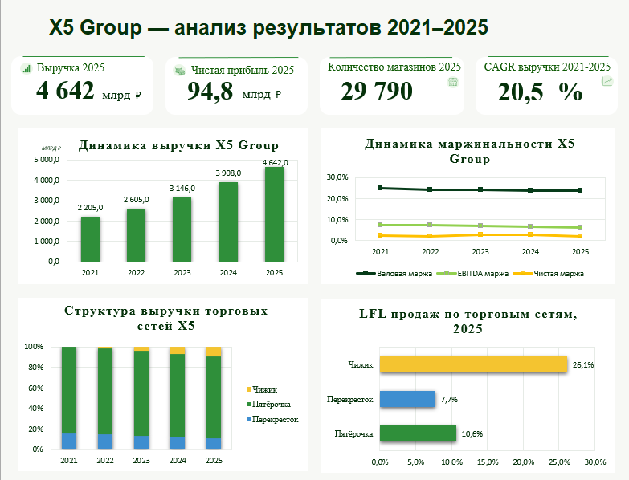

# X5 Group: анализ результатов 2021–2025

Аналитический проект в Excel на основе публичной отчетности X5 Group.

## Цель проекта

Проанализировать динамику финансовых и операционных показателей X5 Group
за 2021–2025 годы и сравнить ключевые торговые форматы компании.

## Инструменты

- Microsoft Excel
- Формулы Excel
- Сводные таблицы
- Диаграммы
- Dashboard
- Финансовый анализ

## Основные показатели

- Выручка
- Чистая прибыль
- EBITDA
- EBITDA margin
- Валовая маржа
- Количество магазинов
- Торговая площадь
- Средний чек
- LFL
- CAGR

## Dashboard

## Ключевые выводы

- Выручка X5 выросла с 2 205 млрд ₽ в 2021 году до 4 642 млрд ₽ в 2025 году.
- CAGR выручки за период составил около 20,5%.
- EBITDA-маржа снизилась с 7,5% до 6,1%.
- Чижик стал самым быстрорастущим из анализируемых форматов.
- LFL Чижика в 2025 году составил 26,1%.
- Перекрёсток показал максимальную выручку на один магазин.

## Структура Excel-файла

- `Основные_Данные` — основные показатели X5
- `Форматы` — данные по Пятёрочке, Перекрёстку и Чижику
- `Сводная_по_сетям` — агрегированные показатели торговых сетей
- `Анализ` — расчётные метрики и промежуточный анализ
- `Дашборд` — итоговая визуализация

## Источники данных

Публичные годовые отчёты X5 Group за 2021–2025 годы.

## Файл проекта

`X5_Group_Анализ_2021_2025.xlsx`
